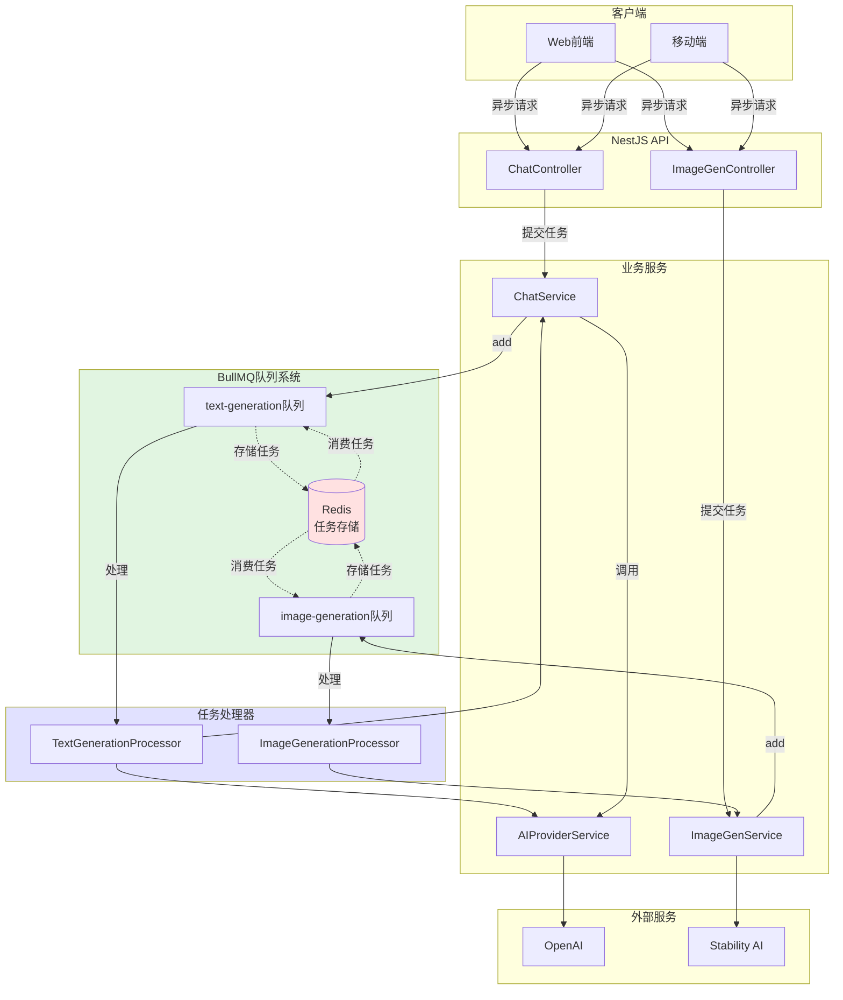
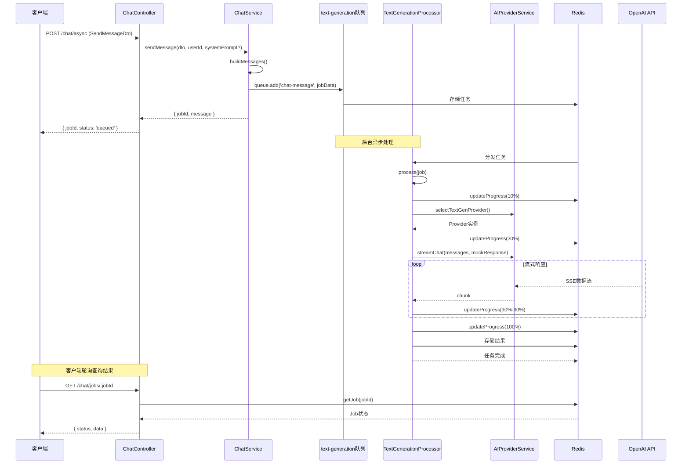
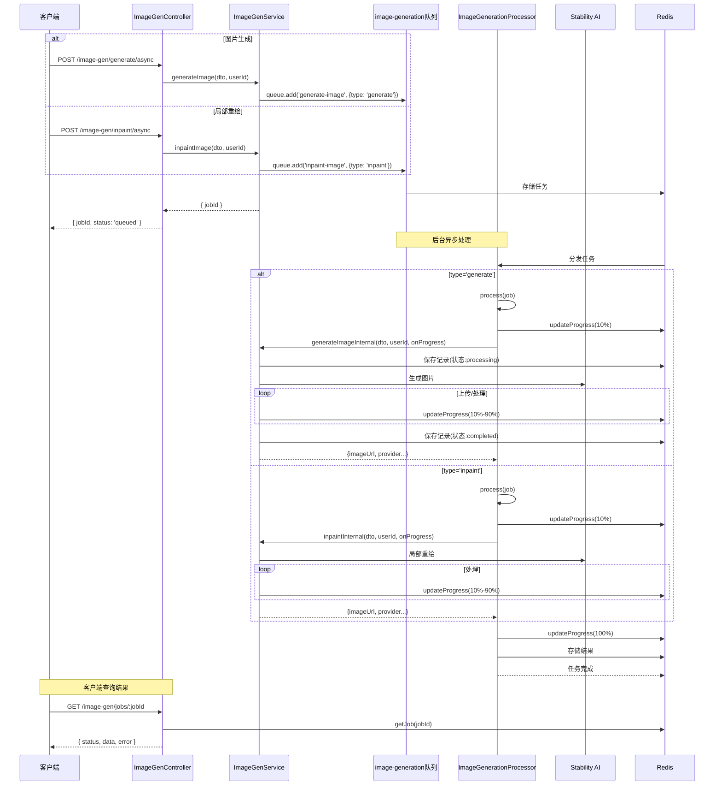
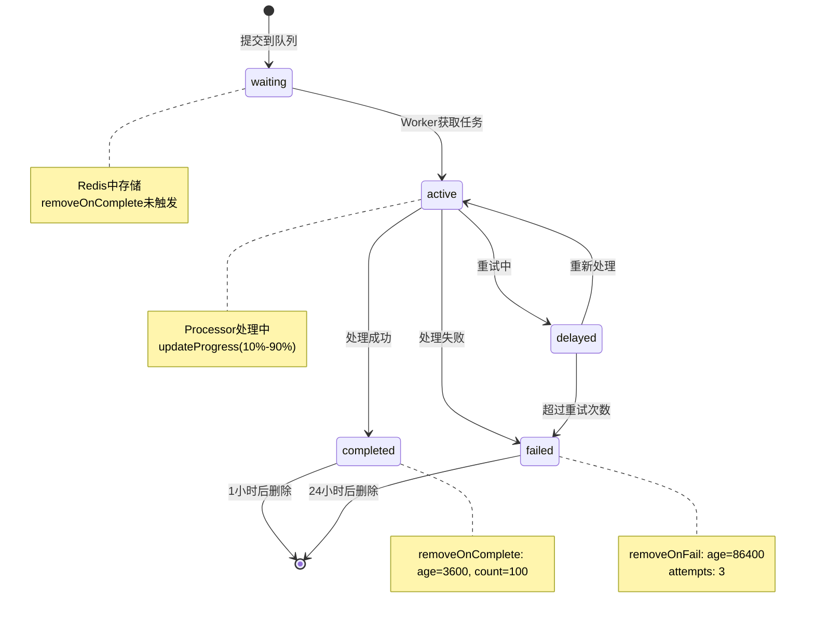

# 异步队列流程图

## 整体架构

## 文本生成详细流程

## 图片生成详细流程

## 任务状态流转

## 队列配置参数

| 参数 | 值 | 说明 |
|------|-----|------|
| `attempts` | 3 | 失败重试次数 |
| `backoff.type` | exponential | 退避策略 |
| `backoff.delay` | 2000 | 基础延迟(ms) |
| `removeOnComplete.age` | 3600 | 成功任务保留时间(秒) |
| `removeOnComplete.count` | 100 | 最多保留成功任务数 |
| `removeOnFail.age` | 86400 | 失败任务保留时间(秒) |

## API端点

### 文本生成
- `POST /chat/async` - 提交异步对话任务
- `GET /chat/jobs/:jobId` - 查询任务状态

### 图片生成
- `POST /image-gen/generate/async` - 提交图片生成任务
- `POST /image-gen/inpaint/async` - 提交局部重绘任务
- `GET /image-gen/jobs/:jobId` - 查询任务状态
